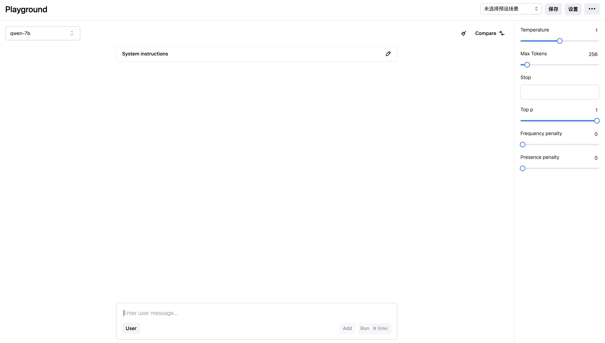

# ChatGPT playground clone

This is a very simple playground clone. The tech stack is
* [Nuxt.js](https://nuxt.com/)
* [Vue3](https://v3.vuejs.org/)
* [Tailwind CSS](https://tailwindcss.com/)
* [Nuxtui](https://ui.nuxt.com/)



## Setup

1. install [ollama](https://ollama.com) and start the server with `ollama serve`

2. Make sure to install the dependencies:

    ```bash
    # pnpm
    pnpm install
    ```
3.

## Development Server

Start the development server on `http://localhost:3000`:

```bash
# pnpm
pnpm run dev
```

## Production

Build the application for production:

```bash
# pnpm
pnpm run build
```

Locally preview production build:

```bash
# pnpm
pnpm run preview

```

# TODO:
* 数据改成indexDB存储
* 另存为场景如果用户没有该名称，则将名称后面添加（copy）
* 模型添加后，跳转到模型，并focus，或者新添加的模型永远在前面
* textarea 编辑时 滚动条乱跳  vueuse也有这个问题
发现只要上方距离超不过有500px（好像不是按像素，是百分比），就不会有任何问题，感觉是高度计算bug
* markdown对于用户输入的html标签该怎么渲染
* preset保存config，tools