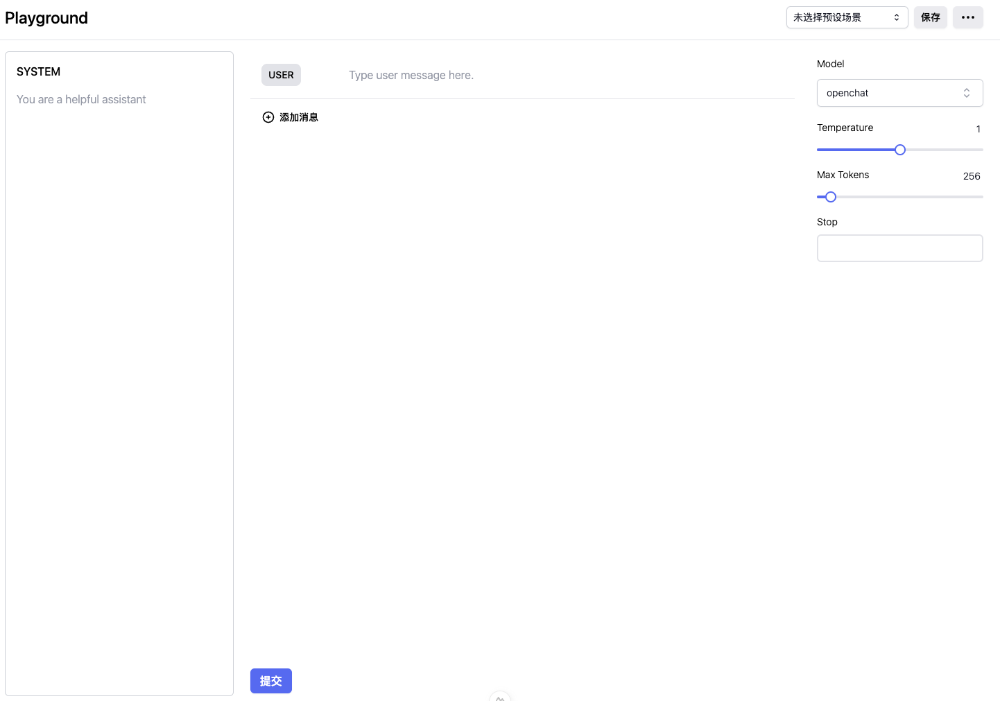

# ChatGPT playground clone

This is a very simple playground clone. The tech stack is
* [Nuxt.js](https://nuxt.com/)
* [Vue3](https://v3.vuejs.org/)
* [Tailwind CSS](https://tailwindcss.com/)
* [Nuxtui](https://ui.nuxt.com/)



## Setup

1. install [ollama](https://ollama.com) and start the server with `ollama serve`

2. Make sure to install the dependencies:

    ```bash
    # pnpm
    pnpm install
    ```
3.

## Development Server

Start the development server on `http://localhost:3000`:

```bash
# pnpm
pnpm run dev
```

## Production

Build the application for production:

```bash
# pnpm
pnpm run build
```

Locally preview production build:

```bash
# pnpm
pnpm run preview

```
